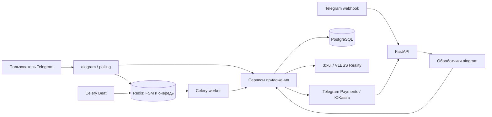

# VPN SaaS Telegram Bot


Python-монорепозиторий сервиса продажи и управления VPN-подписками через Telegram. Пользователь выбирает тариф, оплачивает подписку и получает VLESS Reality-конфигурацию, QR-код и ссылку импорта. Администратор управляет пользователями, VPN-серверами и промокодами прямо в боте.

Проект объединяет Telegram-бота, HTTP API, интеграции оплаты и VPN-панелей, фоновые задачи и контейнерное окружение. Интерфейс бота — на русском языке.

## Возможности

- Покупка и продление подписок; бесплатный стартовый тариф с лимитом 5 ГБ.
- Telegram Payments, ЮKassa и оплата с внутреннего баланса.
- Пополнение баланса, скидки и бонусные дни по промокодам.
- Реферальная программа и уровни Codex Pass с наградами.
- Несколько VPN-серверов и перенос активной подписки между ними.
- Управление клиентами 3x-ui: создание, продление и удаление доступа.
- VLESS Reality-ссылки, QR-коды и экспорт подписки для Happ/Hiddify.
- Напоминания, отключение истёкших подписок и проверка лимитов трафика.
- Админ-команды, блокировка пользователей, рассылка и журнал действий.
- Polling для разработки и webhook для серверного запуска.

## Стек и архитектура

| Компонент | Технологии и назначение |
| --- | --- |
| Telegram | aiogram 3, FSM, обработчики и middleware |
| HTTP API | FastAPI: Telegram webhook, уведомления оплаты, экспорт подписок |
| Данные | PostgreSQL, асинхронный SQLAlchemy 2, Alembic |
| Состояние и задачи | Redis, Celery, Celery Beat |
| Интеграции | HTTPX, ЮKassa, 3x-ui / VLESS Reality |
| Развёртывание | Docker Compose, Nginx |
| Защита данных | Fernet для паролей VPN-панелей и токенов ссылок подписок |



HTTP-обработчики и Telegram-обработчики вызывают общий слой сервисов. В нём сосредоточены расчёт оплаты, жизненный цикл подписки, применение промокодов и работа с VPN-панелями. Фоновые задачи используют те же сервисы.

Подробнее: [архитектура и основные сценарии](docs/architecture.md).

## Структура

```text
app/
  api/           # HTTP-маршруты
  bot/           # Обработчики, клавиатуры, middleware, FSM
  config/        # Настройки из окружения и логирование
  database/      # SQLAlchemy engine и сессии
  models/        # Пользователи, тарифы, оплаты, подписки, серверы
  services/      # Бизнес-логика и внешние интеграции
  scheduler/     # Celery-приложение и фоновые задачи
  utils/         # Шифрование, QR-коды, тексты и даты
alembic/         # Миграции схемы БД
deploy/nginx/    # Reverse proxy и пример конфигурации домена
tests/           # Проверки без внешних сервисов
.github/         # GitHub Actions
```

## Быстрый запуск в Docker

Нужны Git, Docker с Compose, токен Telegram-бота и настроенная панель 3x-ui с VLESS Reality inbound. Для платёжных сценариев нужны тестовые или рабочие реквизиты провайдера. Пример `.env` содержит заглушки и сам по себе не подключает внешние сервисы.

```bash
git clone https://github.com/grishique/bot-vpn.git
cd bot-vpn
cp .env.example .env
```

В PowerShell вместо `cp` можно использовать `Copy-Item .env.example .env`.

Заполните `.env`:

- `TELEGRAM_BOT_TOKEN` и `TELEGRAM_ADMIN_IDS` — токен и числовой ID администратора.
- `APP_SECRET_KEY`, `POSTGRES_PASSWORD`, `TELEGRAM_WEBHOOK_SECRET` — собственные значения. При изменении пароля БД обновите его и в обоих `DATABASE_URL`.
- `PAYMENT_PROVIDER=yookassa` и параметры `YOOKASSA_*`, либо `PAYMENT_PROVIDER=telegram` и `TELEGRAM_PROVIDER_TOKEN`.
- `PUBLIC_BASE_URL` — публичный HTTPS-адрес API для ссылок подписок.
- Ссылки поддержки, политики и условий — адреса вашего сервиса.

По умолчанию пример запускает бота через polling; HTTPS для получения Telegram-сообщений в этом режиме не нужен. Публичный URL необходим для импорта подписок и платёжных webhook.

```bash
docker compose up -d --build
docker compose ps
docker compose logs -f app bot worker
```

Compose ждёт готовности PostgreSQL и Redis, выполняет миграции отдельным контейнером `migrate`, затем запускает приложение, бота и воркеры. Тарифы создаются при инициализации приложения. Nginx доступен на порту `NGINX_PORT` (по умолчанию 80).

После запуска отправьте боту `/start`, затем добавьте VPN-сервер командой `/addserver` от имени администратора. Мастер запросит URL панели, учётные данные, inbound ID и параметры Reality. В репозитории нет готовых серверов или клиентских конфигураций.

Инструкции для [локального Python-запуска и webhook-развёртывания](docs/deployment.md).

## API и администрирование

| Маршрут | Назначение |
| --- | --- |
| `GET /api/v1/health` | Проверка ответа HTTP-процесса; не проверяет БД и Redis |
| `POST /webhook/telegram` | Telegram update с проверкой секретного заголовка |
| `POST /api/v1/payments/yookassa/webhook` | Уведомление оплаты с перепроверкой статуса через API ЮKassa |
| `GET /api/v1/subscriptions/{token}` | Экспорт конфигурации по непрозрачному токену |
| `/docs` | OpenAPI-интерфейс FastAPI |

Основные админ-команды: `/stats`, `/users`, `/user`, `/ban`, `/unban`, `/broadcast`, `/addserver`, `/removeserver`, `/promocodes`, `/cancel`. Доступ определяется `TELEGRAM_ADMIN_IDS`.

Celery Beat сверяет платежи каждую минуту, отправляет напоминания каждый час, проверяет срок подписок каждые 15 минут и лимиты трафика каждые 10 минут.

## Проверки

```bash
python -m venv .venv
# Linux/macOS:
source .venv/bin/activate
# Windows PowerShell: .\.venv\Scripts\Activate.ps1
python -m pip install .
python -m unittest discover -s tests -v
```

Тесты проверяют денежные расчёты, промокоды, шифрование и токены подписок, VLESS-конфигурации и проверку уведомлений оплаты. Используются тестовые настройки; Telegram, БД, Redis и реальные платежи для этих тестов не нужны. GitHub Actions выполняет тесты на Python 3.13 и 3.14, проверяет миграции в offline-режиме и конфигурацию Compose.

## Что демонстрирует проект

Асинхронный Python backend, разделение обработчиков и бизнес-логики, реляционную модель данных и миграции, интеграцию нескольких HTTP API, автоматизацию фоновых процессов и контейнерное развёртывание.

Короткое описание для резюме:

> Telegram-сервис управления VPN-подписками на Python: aiogram, FastAPI, PostgreSQL, Redis и Celery. Реализованы оплата, баланс, промокоды, реферальные бонусы, интеграция 3x-ui и автоматическое управление доступом. Развёртывание через Docker Compose, проверки в GitHub Actions.

## Границы проверки

В репозитории опубликован код приложения и примеры настроек. Реальные токены, пароли, базы пользователей, логи и данные серверов исключены. Полный сценарий с Telegram, платёжным провайдером и VPN-панелью требует отдельного интеграционного запуска. Автоматические тесты не заменяют эту проверку; показатели нагрузки и доступности здесь не заявляются.
